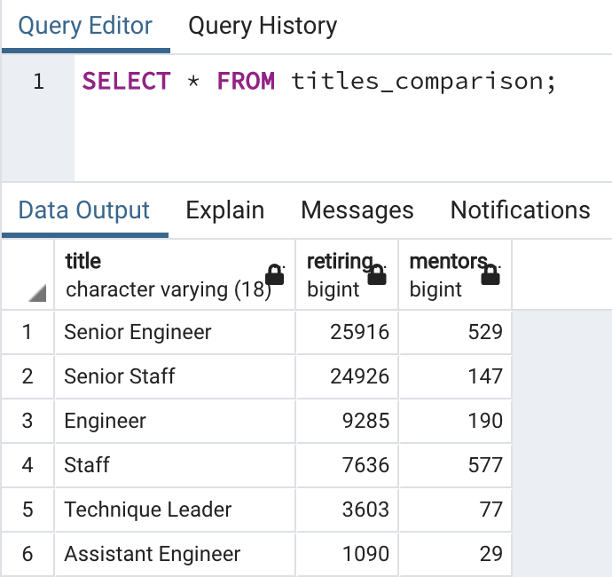

# pewlett-hackard-analysis

## Overview
The purpose of this analysis was to help a large company to prepare itself for its "silver tsunami" of retiring employees. To that end, I was provided a variety of datasets containing information about the company's employees. I transformed that data using PostgreSQL and produced 2 final tables, containing:
1. the number of retiring employees, broken down by their current job title, &
2. a list of retirement-eligible employees, from which the company plans to identify potential mentors for their next generation.

## Results

### Retiring Employees by Title

Two (2) conclusions can be drawn from the table of retiring employees by title:
1. **Senior employees are the most likely to retire.** 
The 2 leading title categories of retiring employees are "Senior Engineer" & "Senior Staff" — together comprising slightly more than 70% of retiring employees. While this is not exactly unsurprising, given that the longer an employee is with the company, the likelier they are to have had the opportunity to be promoted, it would present a problem for the company were there to be insufficient employees with the requisite skills in the "pipeline" to fill these positions going forward.
2. **Many of the employees retiring are classified as "staff."**
Just under 45% of retiring unemployees have the title of "Senior Staff" or "Staff." Without knowing more about the kinds of work staff employees do for the company, it is hard to say to what extent this presents a problem for the company, in terms of filling these roles. However, if the skills required of staff employees are particularly specialized, then the company should prioritize cultivating those skills in its next generation.

### Employees Eligible for Mentorship Program
Three (3) conclusions can be drawn from the table listing eligible mentors.

1. **The number of eligible mentors is substantially smaller than the number of retiring employees.**

With only 1,549 employees eligible to become mentors (according to the company's original parameters) — and 72,458 retiring employees — if the company intended to fill all positions of retiring employees, each mentor would have to take on nearly 47 mentees. Thus, even assuming that the company may only want to fill a fraction of their positions being vacated by retirement, it seems inescapable that they will need to relax their parameters for which employees to include in the mentorship program.

2. **The percentages retiring employees vs. eligible mentors by title category are nearly the same.**
In order to perform this part of my analysis, I created 2 new tables using the following query:

The following table compares the number of retiring employees & the number of eligible mentors by title category:

The percentages of retiring and mentorship-eligible employees by title category were as follows:

|Title Category|Retiring Employees|Eligible Mentors|
|---|---|---|
|Engineer|50.1%|48.3%|
|Staff|44.9%|46.7%|
|Technique Leader|5.0%|5.0%|

The percentages for engineers, staff employees, and technique leaders are remarkably similar. Provided that the company can identify a greater number of mentorship-eligible employees, then, they are at least not at risk of failing to fill a disproportionate number of titles by category.

3. **There are an insufficient number of mentors with senior-level titles.**

|Title Level|Retiring Employees|Eligible Mentors|
|---|---|---|
|Senior employees|70.2%|43.6%|

The percentage of senior-level employees among those who are retiring is vastly greater than the percentage of senior-level employees among those whom the company has identified as eligible mentors. As mentioned above, it is not unexpected that senior-level employees should preponderate among employees choosing to retire. However, the size of the gap does suggest that the company should look into identifying more candidates for senior-level titles, so as to ensure that the next generation of employees will have enough senior-level experience to compensate for employees aging into retirement.

### Summary
Based on my analysis I would make the following recommendations:
1. **The company should relax its parameters for identifying suitable mentors.**
By identifying a larger pool of prospective mentors — perhaps by expanding their age parameters — the company will expand the capacity of their mentorship program to cultivate the skills of the next generation of their employees.
2. **The company should identify more younger employees for promotion to senior-level titles.**
If the company does not develop a plan to promote promising members of their upcoming generation, then their "silver tsunami" could very well become a "brain drain" of senior-level experience.